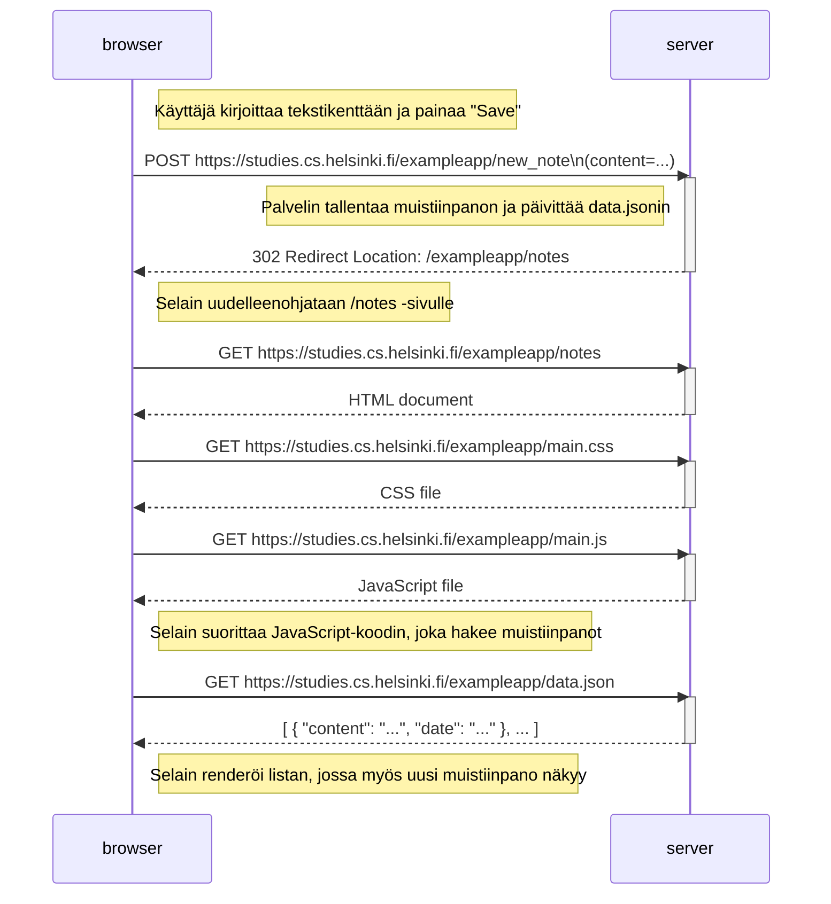

```mermaid
sequenceDiagram
participant browser
participant server

    Note right of browser: Käyttäjä kirjoittaa tekstikenttään ja painaa "Save"

    browser->>server: POST https://studies.cs.helsinki.fi/exampleapp/new_note\n(content=...)
    activate server
    Note left of server: Palvelin tallentaa muistiinpanon ja päivittää data.jsonin
    server-->>browser: 302 Redirect Location: /exampleapp/notes
    deactivate server

    Note right of browser: Selain uudelleenohjataan /notes -sivulle

    browser->>server: GET https://studies.cs.helsinki.fi/exampleapp/notes
    activate server
    server-->>browser: HTML document
    deactivate server

    browser->>server: GET https://studies.cs.helsinki.fi/exampleapp/main.css
    activate server
    server-->>browser: CSS file
    deactivate server

    browser->>server: GET https://studies.cs.helsinki.fi/exampleapp/main.js
    activate server
    server-->>browser: JavaScript file
    deactivate server

    Note right of browser: Selain suorittaa JavaScript-koodin, joka hakee muistiinpanot

    browser->>server: GET https://studies.cs.helsinki.fi/exampleapp/data.json
    activate server
    server-->>browser: [ { "content": "...", "date": "..." }, ... ]
    deactivate server

    Note right of browser: Selain renderöi listan, jossa myös uusi muistiinpano näkyy
```
