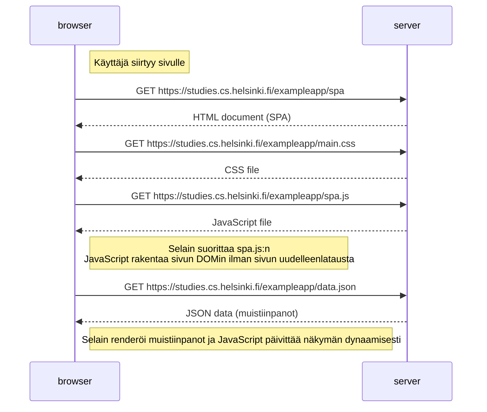

```mermaid
sequenceDiagram
    participant browser
    participant server

    Note right of browser: Käyttäjä siirtyy sivulle

    browser->>server: GET https://studies.cs.helsinki.fi/exampleapp/spa
    server-->>browser: HTML document (SPA)

    browser->>server: GET https://studies.cs.helsinki.fi/exampleapp/main.css
    server-->>browser: CSS file

    browser->>server: GET https://studies.cs.helsinki.fi/exampleapp/spa.js
    server-->>browser: JavaScript file

    Note right of browser: Selain suorittaa spa.js:n<br>JavaScript rakentaa sivun DOMin ilman sivun uudelleenlatausta

    browser->>server: GET https://studies.cs.helsinki.fi/exampleapp/data.json
    server-->>browser: JSON data (muistiinpanot)


    Note right of browser: Selain renderöi muistiinpanot ja JavaScript päivittää näkymän dynaamisesti
```
