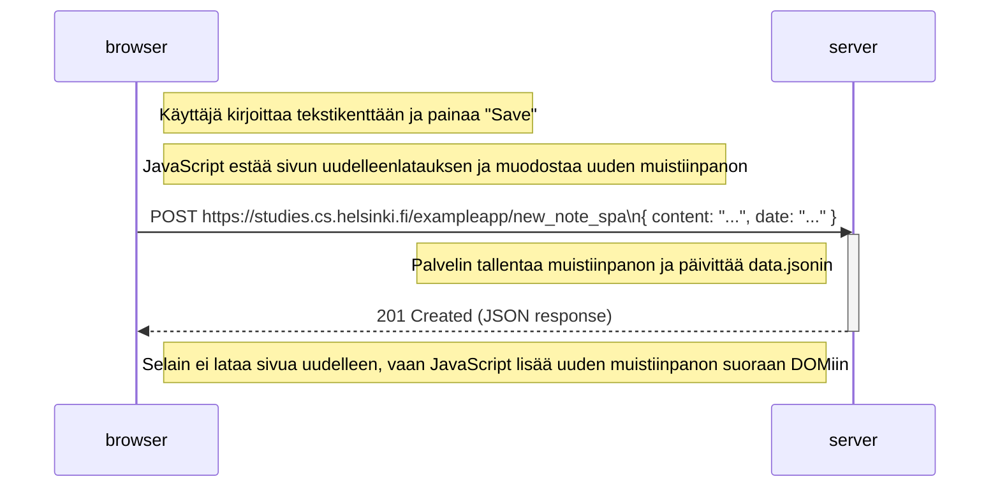

```mermaid
sequenceDiagram
    participant browser
    participant server

    Note right of browser: Käyttäjä kirjoittaa tekstikenttään ja painaa "Save"

    Note right of browser: JavaScript estää sivun uudelleenlatauksen ja muodostaa uuden muistiinpanon

    browser->>server: POST https://studies.cs.helsinki.fi/exampleapp/new_note_spa\n{ content: "...", date: "..." }
    activate server
    Note left of server: Palvelin tallentaa muistiinpanon ja päivittää data.jsonin
    server-->>browser: 201 Created (JSON response)
    deactivate server

    Note right of browser: Selain ei lataa sivua uudelleen, vaan JavaScript lisää uuden muistiinpanon suoraan DOMiin
```
